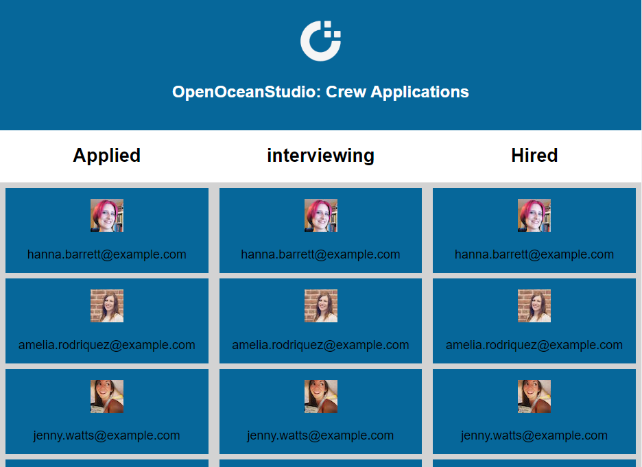
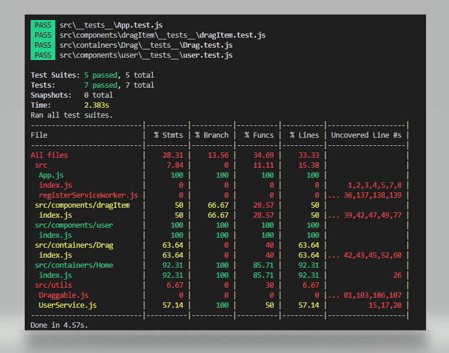
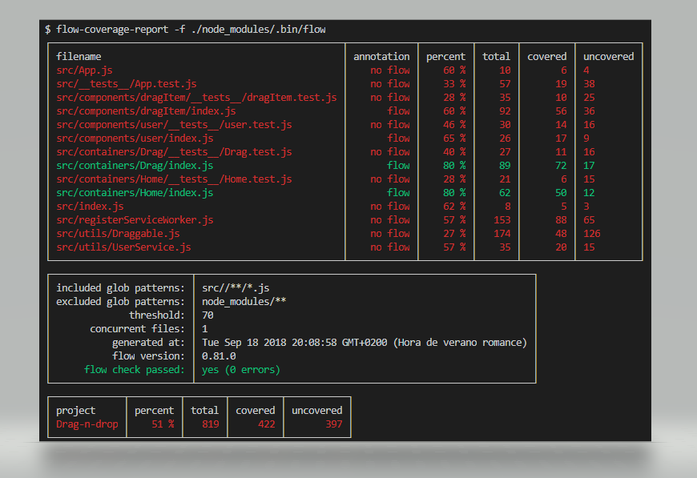

# React assignment

# Exercise

 
 
 
 

 
 

 
 

### Requirements

Create a frontend React app to help with the hiring and onboarding of crew personnel as per the image below:

Prospective crew move through three stages:

- applied
- interviewing
- hired

Data sources:

- Crew personnel data: https://randomuser.me/api/?nat=gb&results=5

Try to progress as far as you can in 2 hours. Feel free to share your thoughts and ask questions throughout, good luck.

### Evaluation points

- correctness of implementation
- unit tests for business logic
- code best practices
- use of docker
- use of code quality enhancer such as linters and flow-type
- use of git, appropriate commit messages
- documentation: README and inline code comments

### Dockerize

If you want to test it in your local environment, follow the next steps in your favourite terminal:
- Build docker image:
   - docker build --rm -f "Dockerfile" -t dragndrop:latest .
- Run it:
   - docker run -it -p 80:5000 --rm dragndrop:latest
- Check it:
   - docker exec -it [container_id] /bin/bash

### Out of scope

- Add redux. Until we don't have an API available to reflect changes this modification will not be done

### Code coverage status

### Flow coverage at 51% (threshold set to 80% -default-)

Full report [here](./flow-coverage/index.html) (./flow-coverage/index.html)

