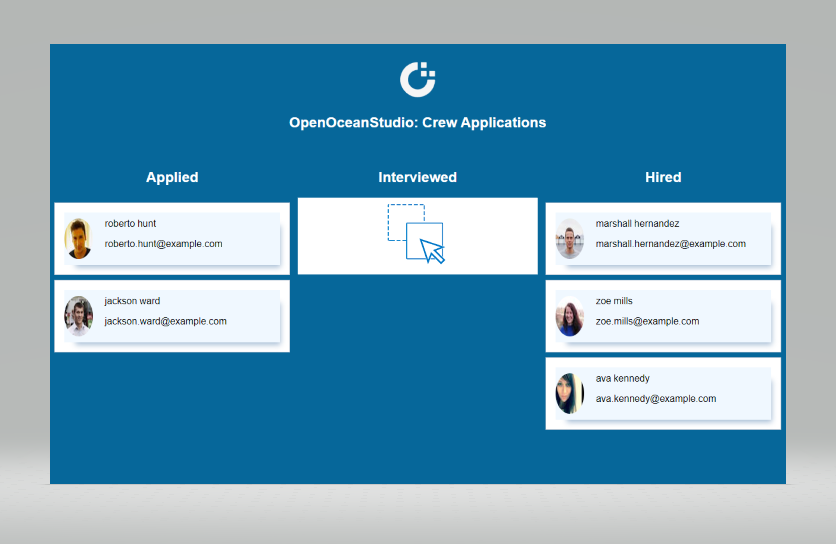

# React assignment

# Exercise

 
 
 
 
 

### Requirements

Create a frontend React app to help with the hiring and onboarding of crew personnel as per the image below:

Prospective crew move through three stages:

- applied
- interviewing
- hired

Data sources:

- Crew personnel data: https://randomuser.me/api/?nat=gb&results=5

Try to progress as far as you can in 2 hours. Feel free to share your thoughts and ask questions throughout, good luck.

### Evaluation points

- correctness of implementation
- unit tests for business logic
- code best practices
- use of docker
- use of code quality enhancer such as linters and flow-type
- use of git, appropriate commit messages
- documentation: README and inline code comments

## WIP. Status

### Missing points

- Drag'n'drop between columns
- Add unit tests

### To improve

- Styles for each "user" component
- Finish Docker file

### Out of scope

- Add redux. Until we don't have an API available to reflect changes this modification will not be done

